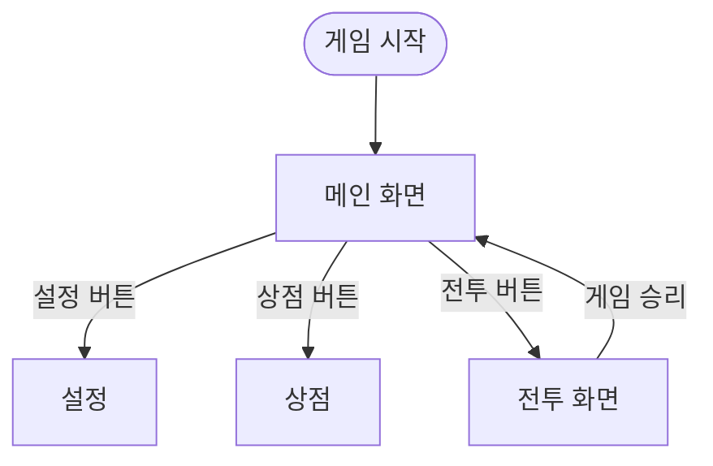

<aside>
👋 우리 팀에 오신 걸 환영합니다! 우리 팀의 미션은요… 추석동안 게임 개발하기 입니다!

- 게임 제목:  클릭! 타이쿤 디펜스(가제)
- 장르: 클리커, 디펜스, 타이쿤
- 팀 멤버: 김선영, 김민석
</aside>

## 개발 일정

---

- [x]  25-10-05 기획 완료
- [x]  25-10-10 로직 제작 (클릭, 상점, 전투, 데이터저장)
- [x]  25-10-12 프로토타입 제작 완료
- [x]  25-10-13 배포 & 버그 테스트

---

# 기획서 ProtoType

# 화면(씬) 종류

1. **메인화면**: (상점, 설정, 전투 등) 버튼이 존재하며, UI가 없는 부분을 클릭 시 재화를 얻을 수 있음
2. **전투 화면:** ~~디펜스가 이루어 지는 씬~~
3. **설정:** 사운드 조절

# 플로우 차트

## 클릭 시스템

- 클릭 시 게임 내 재화가 증가함

## 디펜스 시스템

- 스테이지(웨이브)로 이루어져 있으며 전투 버튼을 눌러 시작 가능
- 특정 웨이브마다(5웨이브) 보스전
- 디펜스에서 얻을 수 있는 재화 존재
- 각 웨이브 클리어 및 실패시 메인 화면으로 넘어간다(클리어 시 다음 전투때 다음 웨이브로 시작)

## 상점 시스템

*일반 상점과 전투 상점이 있음*

재화를 사용하여 구매 가능

### 일반 상점

1. **클릭 업그레이드**: 클릭 당 얻는 재화 증가 (클릭 쿨타임 감소)
2. **알바 고용**: 일정 시간마다 재화 획득
3. **환전**: 재화 간 교환 (ex.골드 ↔ 크리스탈) 

### 전투 상점

디펜스 요소를 강화하거나 구매할 수 있다

1. 성 강화
    1. 체력
    2. 대미지
2. 스킬 구매

필요한 기능

1. 클릭
2. 재화
3. 일반 상점
4. 디펜스
5. 디펜스 상점
